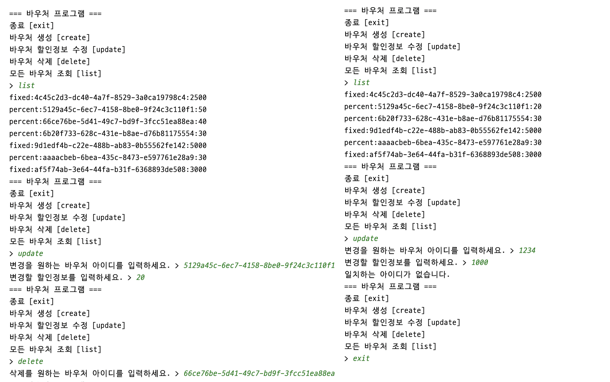

# w3-SpringBoot_Part_A

<br/>

## Mission 2  내용 

##### 바우처 관리 Command-line Application을 만들어본다. [링크](https://dzone.com/articles/interactive-console-applications-in-java) 

- CommandLineApplication 클래스를 작성한다. 
- AnnotationConfigApplicationContext 를 이용해서 IoC 컨테이너를 생성하고 서비스, 레포지토리를 빈으로 등록한다. 
- 프로그램이 시작하면 다음과 같이 지원가능한 명령어를 알려준다. 

```
=== Voucher Program === 
Type exit to exit the program. 
Type create to create a new voucher. 
Type list to list all vouchers.
```


- create / list 커맨드를 지원한다. 
  - create 커맨드를 통해 바우처를 생성할수 있습니다. (FixedAmountVoucher, PercentDiscountVoucher) 
  - list 커맨드를 통해 만들어진 바우처를 조회할 수 있습니다. 
  - 바우처를 메모리에 관리해세요. 어플리케이션이 종료가 되어 데이터가 모두 사라져도 괜찮습니다. 

---

<br/>

## Mission 3  내용 

- 컴포넌트 스캔을 통해서 빈이 등록되도록 해보기
- 메모리 관리가 아닌 파일로 관리가 되는 Repository를 만들어 보기

---

<br/>

## Mission 4 내용

- 고객 블랙 리스트 명단 작성하기
  - customer_blacklist.csv 파일을 만들고 스프링 애플리케이션에서 해당 파일을 읽을 수 있고 블랙 리스트조회 가능 
- YAML 프라퍼티를 만들고 어떤 설정을 만들수 있을지 고민하기 
- 바우처를 메모리에서 관리하는 레포지토리는 개발 프로파일에서만 동작하게 해보기

---

<br/>

## Mission 5 내용

- SpringBoot 어플리케이션으로 변경 (SpringApplication 사용)

- 실행가능한 jar 파일 생성하기

  - ```shell
    mvn clean package spring-boot:repackage
    ll target/
    java -jar target/dev-springboot-order-0.0.1-SNAPSHOT.jar
    ```

    

    


- 적절한 로그를 기록하고 로그백 설정을 해서 에러는 파일로 기록하기

  

  

---


# w4-SpringBoot_Part_A

<br/>

## Weekly Mission 내용 


#### (기본 과제) **바우처 관리 애플리케이션**

[x]  바우처 관리 애플리케이션에 단위테스트를 작성해보세요.

- 가능한 많은 단위 테스트코드를 작성하려고 노력해보세요.
- 엣지 케이스(예외 케이스)를 고려해서 작성해주세요.
- Hamcrest 의 메쳐들을 다양하게 작성해보고 익숙해져 보세요.

[x]  바우처 관리 애플리케이션에서도 과정에서 다루었던 고객을 적용해보세요.

- customers 테이블 정의 및 추가
- CustomerRepository 추가 및 JdbcTemplate을 사용해서 구현

[x]  (1주차를 파일로 관리하게 했다.) 바우처 정보를 DB로 관리해보세요.

- 바우처에 엔터티에 해당하는 vouchers 테이블을 한번 정의해보세요.
- 바우처 레포지토리를 만들어보세요. (JdbcTemplate을 사용해서 구현)
- 기존의 파일에서 바우처를 관리한 것을 vouchers 테이블을 통해서 CRUD가 되게 해보세요.



#

#### (심화 과제) **바우처 지갑을 만들어보세요.**

- 특정 고객에게 바우처를 할당할 수 있습니다.
- 고객이 어떤 바우처를 보유하고 있는지 조회할 수 있어야 합니다.
- 고객이 보유한 바우처를 제거할 수 있어야 합니다.
- 특정 바우처를 보유한 고객을 조회할 수 있어야 합니다.

